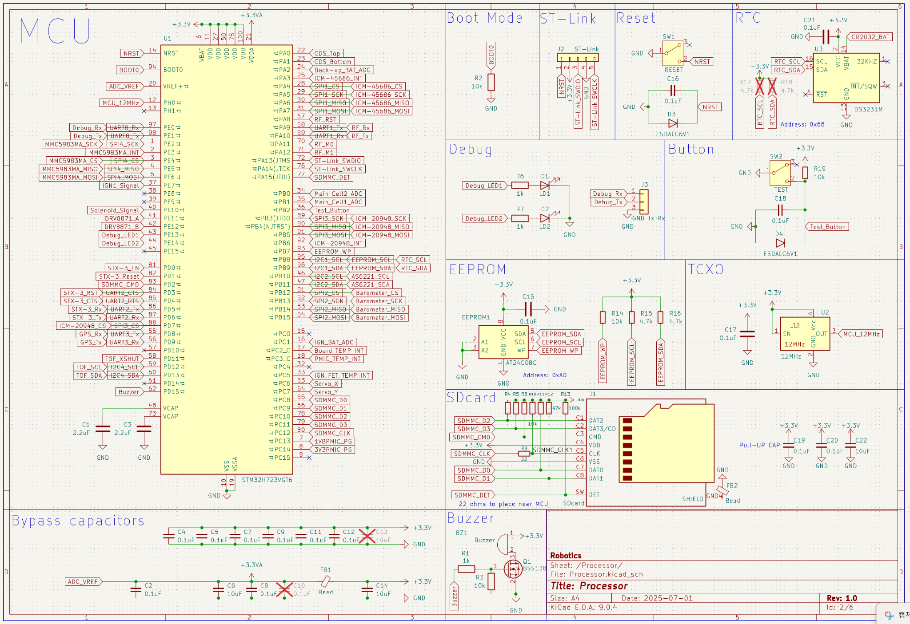
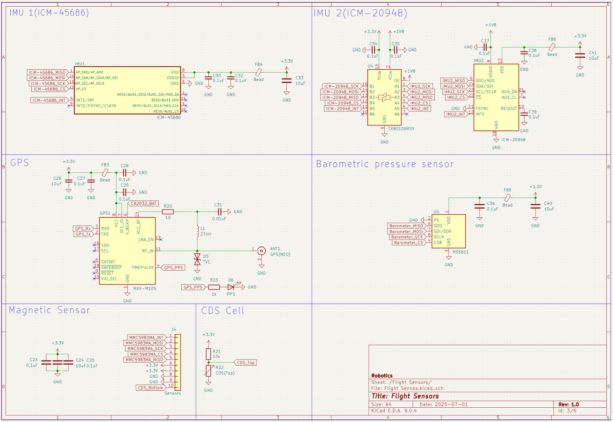
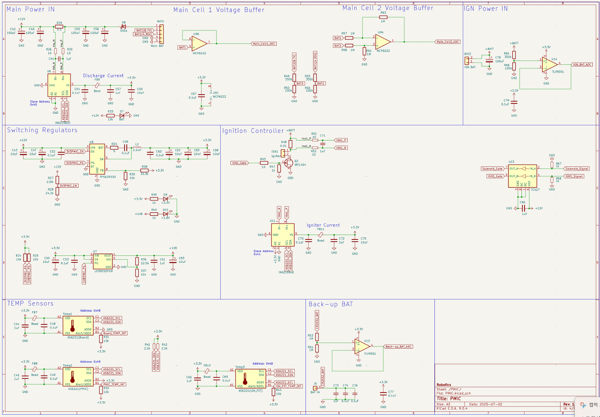
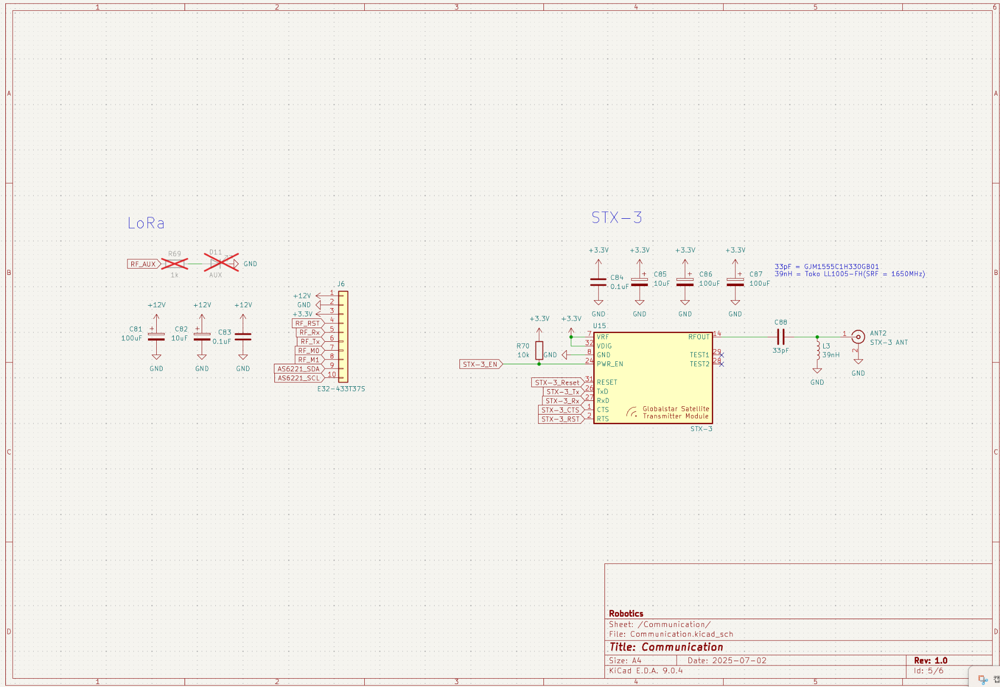
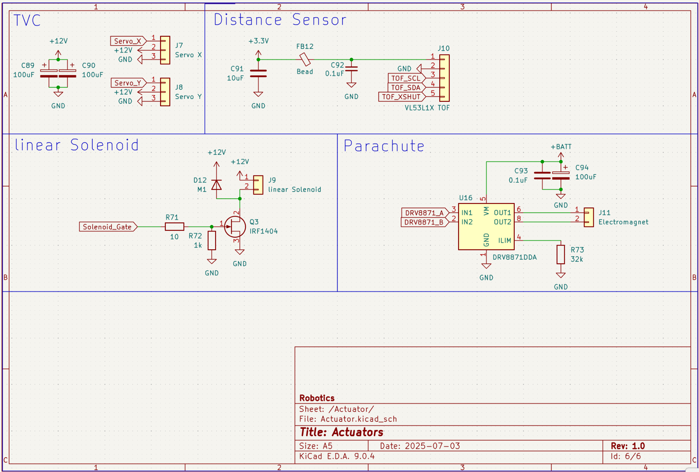
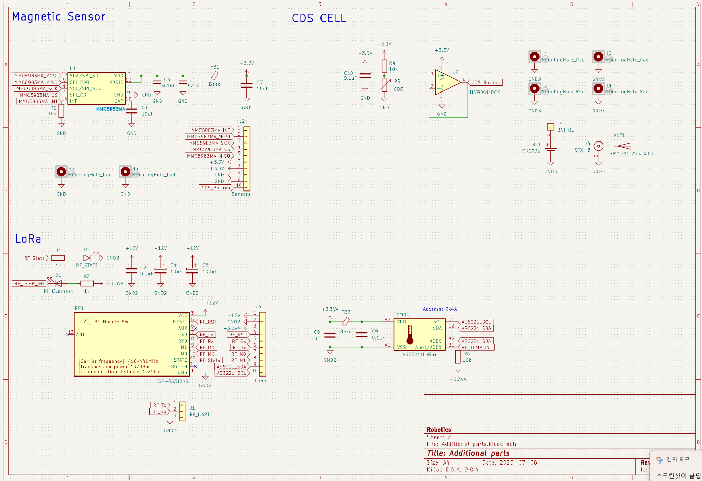

# HyperionSAT Flight-Computer – Hardware (2025)

> **Rev**: 1.0 · **ECAD**: KiCad 9.0.4 · **MCU**: STM32H723VGT6 (550 MHz, DP‑FPU)  
> **Role**: Hybrid flight computer for 2nd‑stage burn, TVC control, sensing, and comms

---

## Repository Layout (snapshot)
```
docs/
└─ images/
   ├─ sch_processor.png
   ├─ sch_sensors.png
   ├─ sch_pmic.png
   ├─ sch_comm.png
   ├─ sch_actuators.png
   └─ sch_additional.png
README.md
```
> Add PCB photos (Top/Bottom) later under `docs/images/` when available.

---

## 1) System Overview

**Blocks**
- **Processor**: STM32H723VGT6, 12 MHz TCXO, SWD, EEPROM(AT24C08C), RTC(DS3231M), Buzzer/LED, microSD(SDMMC 4‑bit).
- **Flight Sensors**: ICM‑45686(SPI), ICM‑20948(SPI, 1.8 V IO), MS5611(SPI), MMC5983MA(SPI), MAX‑M10S(UART+PPS), VL53L1X(I²C), **CDS‑Top/Bottom**(Bottom=TLV9001 buffer).
- **Actuators**: TVC Servo X/Y(12 V), **Linear Solenoid**(IRF1404, adapter release), **Parachute Electromagnet**(DRV8871DDA).
- **Communications**: LoRa E32‑433T37S(UART + M0/M1/AUX), **Globalstar STX‑3**(UART + EN/RESET), RF matching network.
- **PMIC/Power**: Main Li‑Po 3S (Cell1/2 buffered ADC), **Ignition battery** (pack‑voltage ADC), 3.3 V switching, **INA219** for discharge/ignition current, **AS6221** board temps.
- **Capacitors**: 100 µF parts are **polymer tantalum** capacitors (high ripple/low ESR points).

**Ignition**: **Single‑channel** configuration (simplified from earlier multi‑channel plan).

---

## 2) Electrical Interfaces (net labels)

### SPI
| Bus | Device | Signals |
|---|---|---|
| SPI‑A | ICM‑45686 | `ICM-45686_SCK/MISO/MOSI/CS`, `ICM-45686_INT` |
| SPI‑B | ICM‑20948, MS5611 | `ICM-20948_SCK/MISO/MOSI/CS`, `IMU2_INT`; `Barometer_SCK/MISO/MOSI/CS` |
| SPI‑C | MMC5983MA | `MMC5983MA_SCK/MISO/MOSI/CS`, `MMC5983MA_INT` |

### I²C (7‑bit)
| Bus | Device | Addr |
|---|---|---|
| RTC | DS3231M | 0x68 |
| EEPROM | AT24C08C | 0x50 *(datasheet 8‑bit code 0xA0)* |
| TEMP | AS6221 (Board/PMIC/FET/LoRa) | 0x48 / 0x49 / 0x4B / 0x4A |
| IGN | INA219 | 0x41 |

### UART / Timing / GPIO
| Link | Signals |
|---|---|
| Debug | `Debug_Tx`, `Debug_Rx` |
| LoRa(E32) | `RF_Tx`, `RF_Rx`, `RF_M0`, `RF_M1`, `RF_AUX` |
| STX‑3 | `STX-3_Tx`, `STX-3_Rx`, `STX-3_CTS`, `STX-3_RTS`, `STX-3_EN`, `STX-3_Reset` |
| GPS | `GPS_Tx`, `GPS_Rx`, `GPS_PPS` |
| SDMMC | `SDMMC_D0..D3`, `SDMMC_CLK`, `SDMMC_CMD`, `SDMMC_DET`, `SDMMC_WP` |
| Actuators | `Servo_X`, `Servo_Y`, `Solenoid_Gate`, `DRV8871_A`, `DRV8871_B` |
| Analog | `Main_Cell1_ADC`, `Main_Cell2_ADC`, `IGN_BAT_ADC`, `Back-up_BAT_ADC`, `CDS_Top`, `CDS_Bottom_ADC` |

---

## 3) Schematic Snapshots

- **Processor**  
  

- **Flight Sensors**  
  

- **PMIC / Power**  
  

- **Communications**  
  

- **Actuators**  
  

- **Additional parts (Magnetometer SPI, CDS Bottom buffer, LoRa temp)**  
  

---

## 4) Bring‑Up Checklist

1. Visual: polarity/orientation/bridges; **polymer tantalum 100 µF** locations verified.  
2. PSU: 12 V CC ramp 0.2→0.8 A, 3.3 V ripple < 50 mVp‑p.  
3. I²C scans per bus (RTC/EEPROM/TEMP/IGN).  
4. RTC `SQW/INT` interrupt; EEPROM 64 B R/W.  
5. SPI sensors WHOAMI order: ICM‑45686 → ICM‑20948 → MS5611 → MMC5983MA.  
6. GPS NMEA & 1 PPS.  
7. SDMMC 4‑bit, long writes (≥64 KB) w/ 22 Ω series near MCU.  
8. Actuators: Servo PWM range, Solenoid transient, DRV8871 `ILIM=32 kΩ`.  
9. **Ignition 1‑ch**: TC427 → dummy load; confirm **INA219** current log.  
10. LoRa/STX‑3: EN/RESET sequence, UART link; later RF tuning (STX‑3 π‑match).

---

## 5) Notes

- TXB0106 auto‑direction level shifting can be marginal for SPI; consider fixed‑direction translators for robustness if issues arise.  
- RF: STX‑3 π‑network values are initial; retune with VNA after final antenna/cable selection.  
- ADC: Cell buffers require gain/offset calibration; store in EEPROM alongside PID gains.

---

_Last updated: 2025-08-24_
