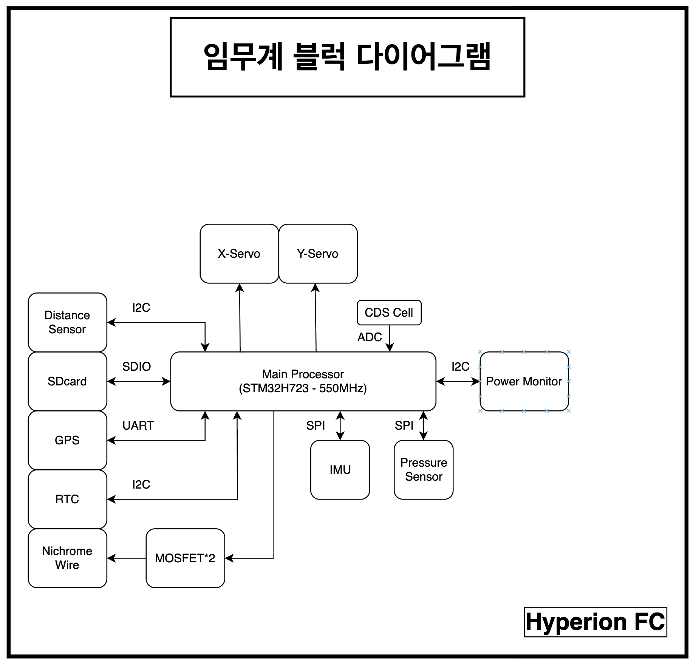
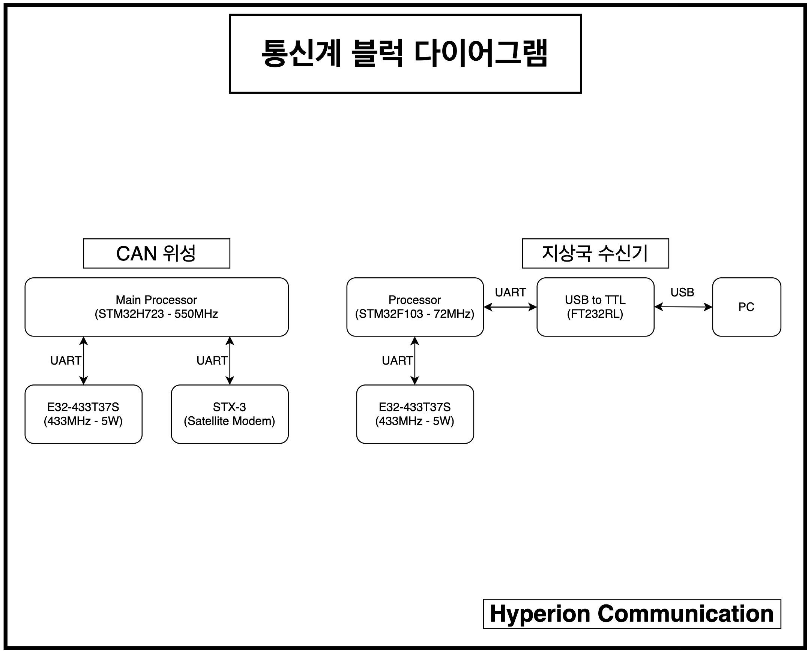
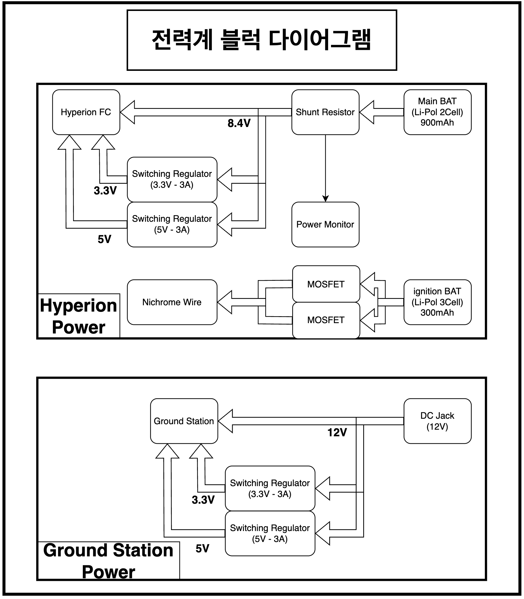
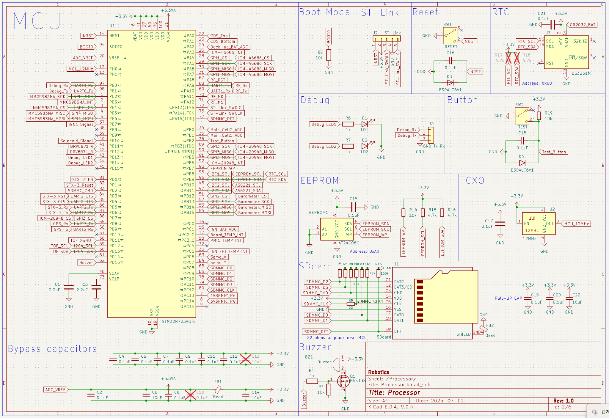
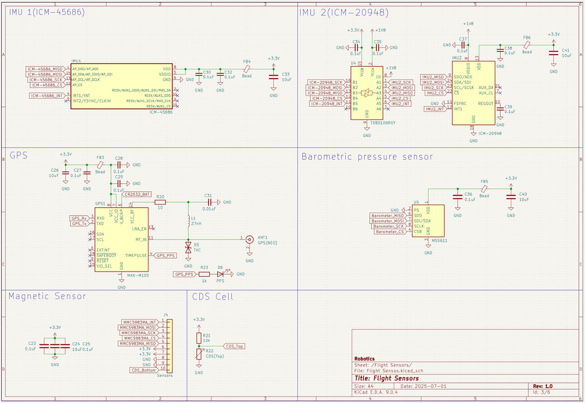
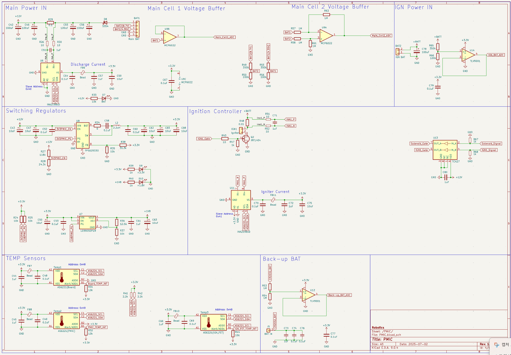
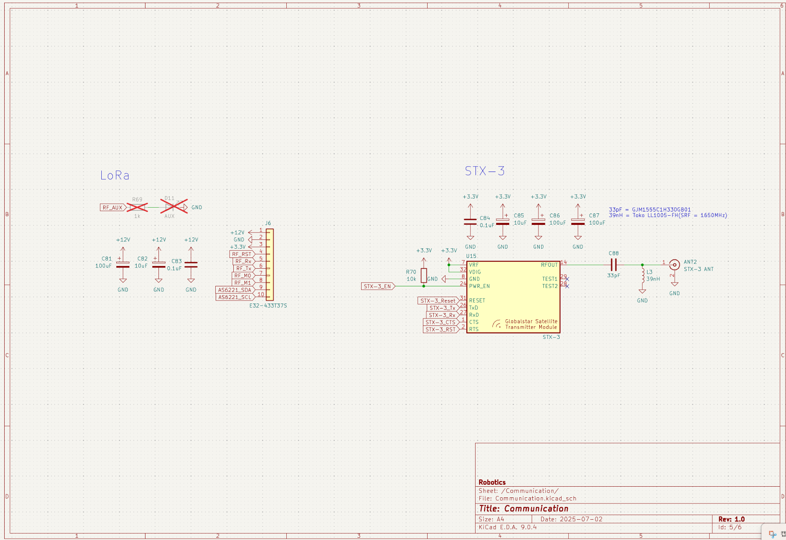
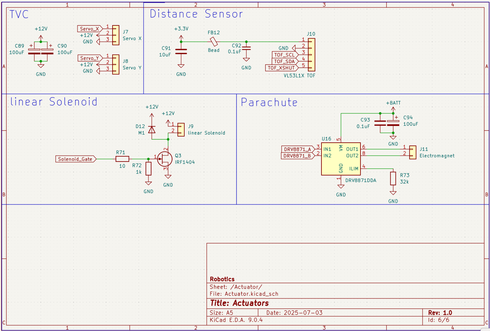
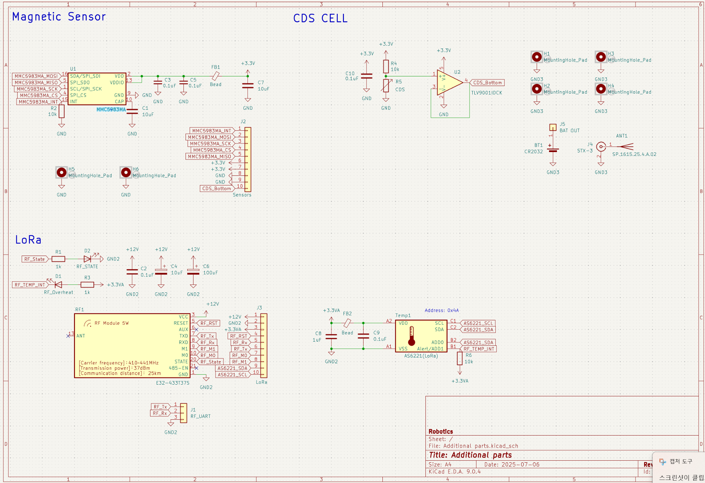

# HyperionSAT Flight‑Computer – 하드웨어 (2025)

> **Rev**: 1.0 · **ECAD**: KiCad 9.0.4 · **MCU**: STM32H723VGT6 (550 MHz, DP‑FPU)  
> **역할**: 2차 추진, TVC 제어, 센싱, 통신을 담당하는 하이브리드 비행 컴퓨터

---

## 리포지토리 구성 (스냅샷)
```
docs/
└─ images/
   ├─ sch_processor.png
   ├─ sch_sensors.png
   ├─ sch_pmic.png
   ├─ sch_comm.png
   ├─ sch_actuators.png
   └─ sch_additional.png
README.md
```

---

## 1) 시스템 개요

**블록**
- **Processor**: STM32H723VGT6, 12 MHz TCXO, SWD, EEPROM(AT24C08C), RTC(DS3231M), Buzzer/LED, microSD(SDMMC 4‑bit).
- **Flight Sensors**: ICM‑45686(SPI), ICM‑20948(SPI, 1.8 V IO), MS5611(SPI), MMC5983MA(SPI), MAX‑M10S(UART+PPS), VL53L1X(I²C), **CDS‑Top/Bottom**(Bottom=TLV9001 버퍼).
- **Actuators**: TVC 서보 X/Y(12 V), **리니어 솔레노이드**(IRF1404, 어댑터 분리), **낙하산 전개 전자석**(DRV8871DDA).
- **Communications**: LoRa E32‑433T37S(UART + M0/M1/AUX), **Globalstar STX‑3**(UART + EN/RESET), RF 매칭 네트워크.
- **PMIC/Power**: 메인 Li‑Po 3S(셀1/2 버퍼드 ADC), **점화 배터리**(팩 전압 ADC), 3.3 V 스위칭, **INA219** 방전/점화 전류 측정, **AS6221** 온도.

**점화(IGN)**: **1채널** 구성으로 단순화됨.

<h3>Block Diagrams</h3>
<table>
  <tr>
    <td><a href="docs/images/block-diagram-obc.png"></a></td>
    <td><a href="docs/images/block-diagram-comm.png"></a></td>
    <td><a href="docs/images/block-diagram-power.png"></a></td>
  </tr>
  <tr>
    <td align="center"><sub>OBC</sub></td>
    <td align="center"><sub>Communication</sub></td>
    <td align="center"><sub>Power</sub></td>
  </tr>
</table>

---

## 2) 전기적 인터페이스 (네트 라벨 기준)

### SPI
| Bus | Device | Signals |
|---|---|---|
| SPI‑A | ICM‑45686 | `ICM-45686_SCK/MISO/MOSI/CS`, `ICM-45686_INT` |
| SPI‑B | ICM‑20948, MS5611 | `ICM-20948_SCK/MISO/MOSI/CS`, `IMU2_INT`; `Barometer_SCK/MISO/MOSI/CS` |
| SPI‑C | MMC5983MA | `MMC5983MA_SCK/MISO/MOSI/CS`, `MMC5983MA_INT` |

### I²C (7‑bit)
| Bus | Device | Addr |
|---|---|---|
| RTC | DS3231M | 0x68 |
| EEPROM | AT24C08C | 0x50 *(데이터시트 8‑bit 코드 0xA0)* |
| TEMP | AS6221(Board/PMIC/FET/LoRa) | 0x48 / 0x49 / 0x4B / 0x4A |
| IGN | INA219 | 0x41 |

### UART / 타이밍 / GPIO
| Link | Signals |
|---|---|
| Debug | `Debug_Tx`, `Debug_Rx` |
| LoRa(E32) | `RF_Tx`, `RF_Rx`, `RF_M0`, `RF_M1`, `RF_AUX` |
| STX‑3 | `STX-3_Tx`, `STX-3_Rx`, `STX-3_CTS`, `STX-3_RTS`, `STX-3_EN`, `STX-3_Reset` |
| GPS | `GPS_Tx`, `GPS_Rx`, `GPS_PPS` |
| SDMMC | `SDMMC_D0..D3`, `SDMMC_CLK`, `SDMMC_CMD`, `SDMMC_DET`, `SDMMC_WP` |
| Actuators | `Servo_X`, `Servo_Y`, `Solenoid_Gate`, `DRV8871_A`, `DRV8871_B` |
| Analog | `Main_Cell1_ADC`, `Main_Cell2_ADC`, `IGN_BAT_ADC`, `Back-up_BAT_ADC`, `CDS_Top`, `CDS_Bottom_ADC` |

---

## 3) 회로도 스냅샷

- **Processor**  
  

- **Flight Sensors**  
  

- **PMIC / Power**  
  

- **Communications**  
  

- **Actuators**  
  

- **Additional parts (Magnetometer SPI, CDS Bottom 버퍼, LoRa 온도)**  
  


> **Firmware repo**: [https://github.com/ORG/REPO-FW  ](https://github.com/jmh8231-Dev/hyperionsat-fw-2025)
